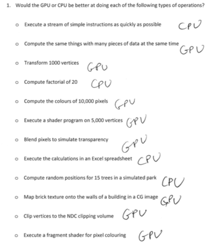

*Contributors: Anthony Klyza, Jamie Simpson*

## World, NDC, and Viewport

### World

World coords mapped to NDC and clipped. NDC coords mapped to the viewport (400x400).

### Vectors

A vector is a mathematical object that has a magnitude and a direction but no origin. A vector can be moved and still maintain the same value regardless of its position.

To add two vectors, put the tail of one at the head of the other. The sum of the vectors, the tail of the first vector atttaches to the head of the second vector.

### Parametric Line Equation

Value `t` that changes as we move through the line.
```
p = a +t(b-a)
```

## Handout 2.1

<a src="DraggedImage.png"></a>
