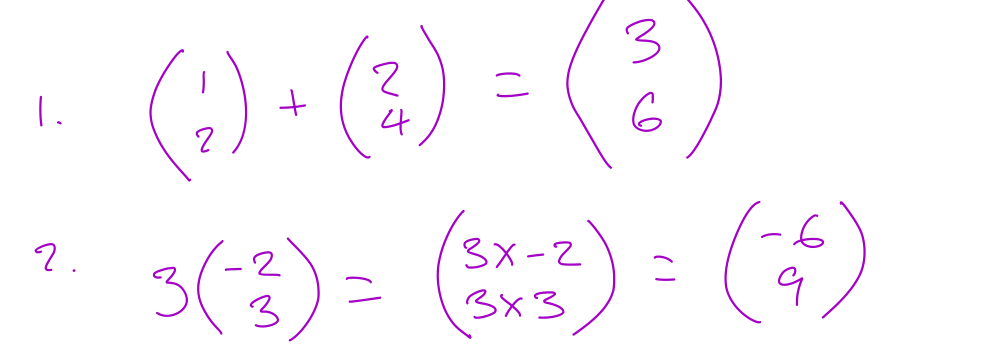

*Contributors: Anthony Klyza, Jamie Simpson*

## World, NDC, and Viewport

### World

World coords mapped to NDC and clipped. NDC coords mapped to the viewport (400x400).

### Vectors

A vector is a mathematical object that has a magnitude and a direction but no origin. A vector can be moved and still maintain the same value regardless of its position.

### Adding

To add two vectors, put the tail of one at the head of the other. The sum of the vectors, the tail of the first vector atttaches to the head of the second vector.


<a href="DraggedImage-1.png"></a>
<a href="DraggedImage-2.png"></a>

When we add the vectors we add the corresponding elements of them together, I.E., add the X values together and the Y values together.


<a href="DraggedImage-3.png"></a>

#### Multiplication

If we multiply (scalar) essentially increases the length of the vector (in x and y) without changing direction.


<a href="DraggedImage-4.png"></a>

#### Computing a vector between two points


<a href="DraggedImage-5.png"></a>

This is infact the same thing as subtracting one vector from another, as points can be thought of as vectors from the origin to the point.

We can also define a line through two points. We have two vectors A and B that we have placed at the origin so that they represent points. We want a line that goes through these two points.

#### Parametric line equation

A parametric line equation is an equation where we have a value T that changes as we move through the line.
I.E.:
```Bash
if T = 0, we are at the point on the line that represents the head of vector A
if T = 1, we are at the point representing the head of Vector B
if T = 0.5, we are half way between the points representing A and B
```
```Bash
p = a +t(b-a)
```


<a href="DraggedImage-6.png"></a>

We want to find an equation for point P such that it is on the line.
We know that if T = 0, it should be at A
If T = 1, we want P = B.

We define the magnitude of a vector as its length.(vectors are normally written as Boldface letters (ie. **a**) while scalars are written as Italics (ie. *t*).
The magnitude of a vector (length) = `|a| = √ax^2 + ay^2`
This is the euclidean length of the vector.


<a href="DraggedImage-10.png"></a>

A unit vector is a vector where its length is equal to 1, pointing in the same direction as another vector. We can normalise a vector and get its unit vector, where the unit vector in the direction of a = the vector A, divided by the length of the vector A


<a href="DraggedImage-11.png"></a>

#### Dotproduct

This is equal to the product of all corresponding elements then add them all up. The length of a vector A is equal to the dotproduct of A with itself, squarerooted.


<a href="DraggedImage-12.png"></a>

#### Cosine Rule


<a href="DraggedImage-13.png"></a>

### Matrices

An object that has some numbers in it that when we multiply by a vector we get another vector.
The rule for multiplication here is that we go row by column.


<a href="DraggedImage-14.png"></a><a href="DraggedImage-15.png"></a>

### Polygons
A useful way of drawing shapes.
Webgl breaks polygons down into triangles called a mesh.
one type of poly is a convex poly, where all of the angles go in the same direction,  with no concave angles.

## Handout 2.1

<a href="DraggedImage.png"></a>

## Handout 2.2




<a href="DraggedImage-7.png"></a>
<a href="DraggedImage-8.png"></a>
<a href="DraggedImage-9.png"></a>
